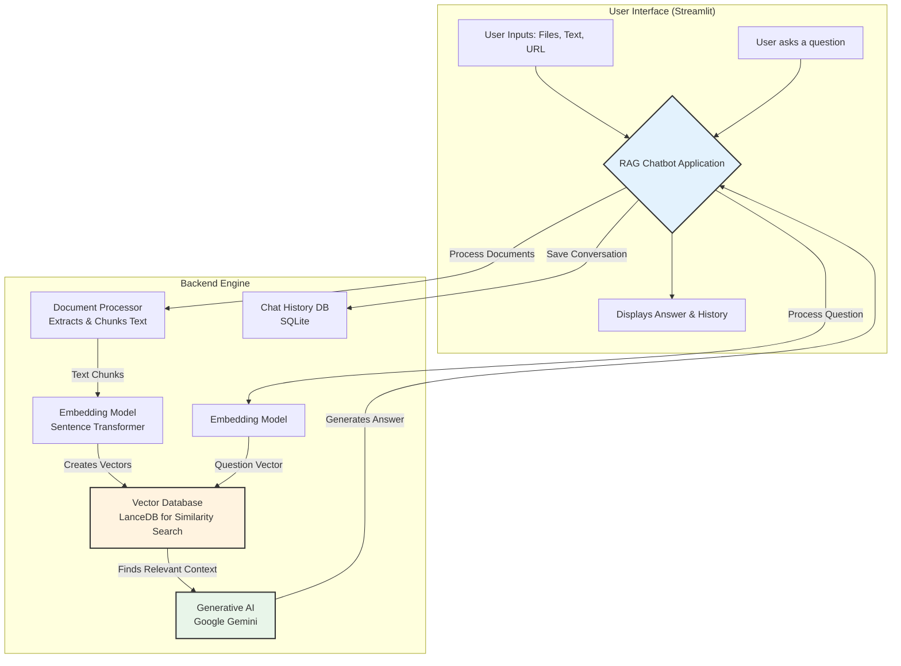

# RAG Chatbot

A Retrieval-Augmented Generation (RAG) chatbot that answers questions based on your documents.


## Features

- **Multiple Input Types**: Text, PDF, DOCX, TXT, and URLs
- **Google Gemini Integration**: Leverage Google's Gemini AI for intelligent responses
- **Vector Database**: Stores and retrieves relevant context using embeddings
- **Chat History**: Save and retrieve past conversations
- **Modern UI**: Clean, responsive interface with dark mode support

## Installation

### Prerequisites

- Python 3.8 or higher
- pip (Python package manager)

### Step 1: Clone the repository

```bash
git clone <repository-url>
cd rag-chatbot
```

### Step 2: Create and activate a virtual environment

#### Windows
```bash
python -m venv venv
venv\Scripts\activate
```

#### macOS/Linux
```bash
python -m venv venv
source venv/bin/activate
```

### Step 3: Install dependencies

```bash
pip install -r requirements.txt
```

### Step 4: Set up environment variables
Manually create a `.env` file in the project root with the following content:

```
GEMINI_API_KEY=your_gemini_api_key_here
PORT=7860
```

## Usage

### Starting the application

Run the application:

```bash
python run_app.py
```

This will start the Streamlit server, and the application will be available at `http://localhost:7860`

### Using the RAG Chatbot

1. **Choose Input Type**: Select the type of document you want to process (Text, PDF, DOCX, TXT, or URL).
2. **Upload or Enter Content**: Depending on the selected input type, upload a file or enter text/URL.
3. **Process Input**: Click the "Process Input" button to build the knowledge base.
4. **Ask Questions**: Once the knowledge base is ready, you can start asking questions related to your documents.

## How It Works

1. **Document Processing**: The application processes your documents, splitting them into smaller chunks.
2. **Vector Embeddings**: Each chunk is converted into an embedding vector using SentenceTransformers.
3. **Storage**: The embeddings are stored in a LanceDB vector database.
4. **Retrieval**: When you ask a question, the application finds the most relevant chunks to your query.
5. **Generation**: The relevant content is sent to Google Gemini AI along with your question to generate an accurate answer.

## Architecture & Flow

### What is RAG?

Retrieval-Augmented Generation (RAG) is an AI architecture that enhances Large Language Models (LLMs) by retrieving relevant information from a knowledge base before generating responses. Instead of relying solely on the model's built-in knowledge, RAG enables the AI to access and use specific documents provided by the user.

### System Overview

The RAG Chatbot is a web application that lets users:
1. Upload or input various document types (PDF, DOCX, TXT, Text, URLs)
2. Ask questions about the content of these documents
3. Receive accurate answers based on the document content
4. Save and view conversation history

### Overall Architecture

This diagram shows the main components of the application and how they work together.



### Core RAG Workflows

The system has two main workflows.

```mermaid
graph TD
    subgraph "Workflow 1: Building the Knowledge Base (Indexing)"
        direction LR
        W1_A[1. User provides<br>a Document] --> W1_B[2. Text is Extracted<br>and split into chunks];
        W1_B --> W1_C[3. Text chunks are converted<br>into numerical vectors (Embeddings)];
        W1_C --> W1_D[4. Vectors are stored in the<br>Vector Database (LanceDB)];
    end

    subgraph "Workflow 2: Answering a Question (Querying)"
        direction LR
        W2_A[1. User asks<br>a Question] --> W2_B[2. The question is converted<br>into a numerical vector];
        W2_B --> W2_C[3. The Vector Database is searched<br>for the most similar text vectors];
        W2_C -- "Relevant text chunks" --> W2_D[4. The Question + Relevant Text<br>are sent to the Gemini AI];
        W2_D --> W2_E[5. The AI generates<br>an answer based on the context];
    end

    style W1_D fill:#e3f2fd,stroke:#333,stroke-width:2px
    style W2_E fill:#e8f5e9,stroke:#333,stroke-width:2px
```

### Technical Architecture

#### Core Modules

1. **document_loader.py**:
   - Handles different input types (PDF, DOCX, TXT, Text, URL)
   - Extracts text content from each source
   - Provides unified interface for text extraction

2. **rag_engine.py**:
   - Splits text into chunks for processing
   - Generates embeddings for each text chunk
   - Creates and manages the vector database
   - Retrieves relevant context for queries
   - Sends prompts to Gemini AI and processes responses

3. **history_storage.py**:
   - Manages SQLite database for conversation persistence
   - Stores user questions and system answers
   - Provides functions to retrieve and display chat history

4. **main.py**:
   - Implements Streamlit UI with all components
   - Coordinates between user input and backend services
   - Displays results and manages application state

5. **run_app.py**:
   - Application entry point
   - Sets up environment and directories
   - Validates project structure
   - Launches the Streamlit server

#### Key Features & Technical Details

1. **Embedding Generation**:
   - Uses SentenceTransformer model ('all-MiniLM-L6-v2')
   - Converts text to 384-dimensional vectors
   - Enables semantic similarity search (finding meaning, not just keywords)

2. **Vector Storage**:
   - Uses LanceDB for efficient vector storage and retrieval
   - Performs similarity search to find context relevant to user questions

3. **Error Handling**:
   - Robust error handling for missing dependencies
   - Permission-based fallbacks for storage locations
   - Graceful degradation when components fail

4. **User Experience**:
   - Clean, responsive interface with modern styling
   - Real-time feedback during processing steps
   - History management for reviewing past interactions

## Project Structure

- `run_app.py`: Main entry point for the application. Handles environment setup, directory creation, error checking, and launches the Streamlit server.
- `setup_env.py`: Helper script to set up environment variables and configure API keys.
- `fix_project_structure.py`: Utility script to fix or verify the project structure if files are missing or in the wrong locations.
- `requirements.txt`: Lists all dependencies needed for the application.
- `Dockerfile`: Configuration for containerizing the application.
- `rag_app/`: Core application code directory
  - `main.py`: Streamlit UI implementation with all user interface components, forms, and interaction logic.
  - `rag_engine.py`: Core RAG functionality including document processing, text chunking, vector embedding, database storage/retrieval, and question answering.
  - `document_loader.py`: Handles various document types (PDF, DOCX, TXT, Text, URL) with graceful fallbacks if dependencies are missing.
  - `history_storage.py`: Manages chat history with SQLite database for persistence across sessions.
  - `logging_config.py`: Configures application logging with file rotation and permission handling.
  - `__init__.py`: Package initialization file.
- `.streamlit/`: Contains Streamlit configuration
  - `config.toml`: Streamlit theme and behavior configuration.
- `chat_data/`: Data directory for persistent storage
  - `knowledge_base/`: LanceDB vector database storage location
  - `logs/`: Application log files
  - `chat_history.db`: SQLite database for conversation history
- `.github/`: GitHub-related files for CI/CD and repository management
- `.gitignore`: Specifies files to be ignored by Git

## Data Flow

1. **Document Processing Pipeline**:
   - User uploads document → Text extraction → Chunking → Embedding → Vector storage
   
2. **Question Answering Pipeline**:
   - User query → Query embedding → Vector similarity search → Context retrieval → LLM prompt construction → Answer generation

3. **Storage Architecture**:
   - Vector Database (LanceDB): Stores document chunks and embeddings for retrieval
   - Relational Database (SQLite): Stores conversation history
   - File System: Stores logs and temporary files

## Customization

### Changing the theme

You can customize the theme by modifying the `.streamlit/config.toml` file:

```toml
[theme]
primaryColor = "#4285f4"
backgroundColor = "#ffffff"
secondaryBackgroundColor = "#f8f9fa" 
textColor = "#212121"
font = "sans serif"
```

## Requirements

- streamlit
- sentence-transformers
- lancedb
- PyPDF2
- python-docx
- google-generativeai
- python-dotenv
- langchain
- beautifulsoup4
- html2text
- requests

## License

This project is licensed under the MIT License - see the LICENSE file for details.

## Acknowledgements

- [Streamlit](https://streamlit.io/) for the web app framework
- [Google Gemini AI](https://ai.google.dev/) for the language model
- [SentenceTransformers](https://www.sbert.net/) for embeddings
- [LanceDB](https://github.com/lancedb/lancedb) for vector storage 